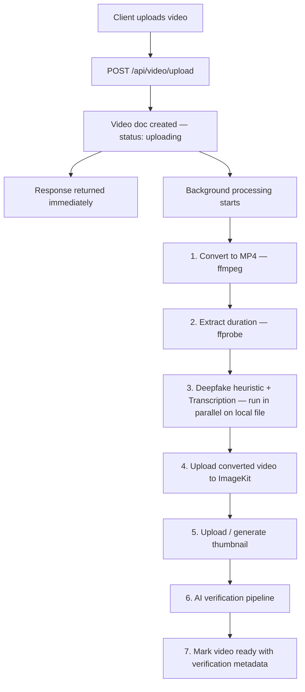
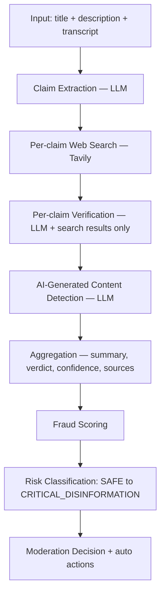

<div align="center">

# 🎬 StreamLine

### AI-Verified Video Platform with Trust & Moderation Engine

A YouTube-style video platform where every upload is automatically fact-checked, screened for AI-generated content, and scored for trust before it goes live.

[](https://nodejs.org/)
[](https://expressjs.com/)
[](https://www.mongodb.com/)
[](https://react.dev/)
[](https://www.langchain.com/)
[](#-license)

[Overview](#-what-it-does) • [Architecture](#️-architecture) • [Tech Stack](#-tech-stack) • [Setup](#️-setup) • [Limitations](#-known-limitations) • [Roadmap](#️-roadmap)

</div>

---

## 📌 What It Does

Upload a video, and StreamLine will automatically:

- ✅ **Transcode & prepare** it (ffmpeg conversion to MP4, duration extraction)
- ✅ **Transcribe** the audio ([AssemblyAI](https://www.assemblyai.com/))
- ✅ **Extract factual claims** from the title, description, and transcript, then verify each one against live web search ([Tavily](https://tavily.com/)) using an LLM ([Google Gemini](https://ai.google.dev/) via [LangChain](https://www.langchain.com/))
- ✅ **Screen for AI-generated content** (synthetic phrasing detection, generation artifact detection)
- ✅ **Run a visual artifact heuristic** on sampled frames — face detection + sharpness/noise mismatch analysis as a lightweight signal for face-swap/synthesis artifacts
- ✅ **Score fraud risk & trust**, and apply automatic moderation actions (warning labels, reach limiting, shadow-banning) based on the combined verdict
- ✅ **Publish** with a visible trust meter and verification summary

All of this happens **asynchronously in the background** — the upload request returns immediately while processing continues, and the client is updated in real time via Socket.io.

---

## 🧱 Tech Stack

<table>
<tr>
<td valign="top" width="33%">

**Backend**
- Node.js + Express 5
- MongoDB + Mongoose
- Redis + BullMQ
- Socket.io
- fluent-ffmpeg
- ImageKit (storage/CDN)

</td>
<td valign="top" width="33%">

**AI / Verification**
- LangChain + Gemini
- Tavily (web search)
- AssemblyAI (transcription)
- `@vladmandic/face-api`
- TensorFlow.js (WASM backend)
- Custom artifact heuristics

</td>
<td valign="top" width="33%">

**Frontend**
- React 19 + Vite
- Redux Toolkit
- Tailwind CSS
- Framer Motion
- HLS.js
- Socket.io client

</td>
</tr>
</table>

---

## 🏗️ Architecture

### Upload Flow



> **Key design decision:** deepfake analysis and transcription both run against the **locally converted file**, before it's uploaded to storage — not by re-downloading the file afterward. This avoids unnecessary storage/CDN bandwidth and transformation costs, and removes a hard dependency on the storage provider's availability during the AI analysis stage.

### AI Verification Pipeline



### Deepfake Artifact Heuristic

Rather than relying on a generic image classifier, StreamLine samples frames from the converted video and, for each detected face:

- Compares **sharpness** (Laplacian variance) between the face region and the background
- Compares **noise level** (pixel intensity standard deviation) between the face region and the background
- Produces a **0–100 artifact score** — the further face and background statistics diverge, the higher the score

> ⚠️ This is a **heuristic signal**, not a trained deepfake classifier — designed to be an honest, lightweight supporting input to the overall trust score rather than a standalone verdict.

---

## 📁 Project Structure

```
backend/
├── config/
│   └── config.js                    # env validation & exports
├── controllers/
│   ├── video.controller.js          # upload, CRUD, background processing
│   └── watch.controller.js          # watch history / progress
├── middleware/
│   ├── auth.middleware.js
│   ├── optionalAuth.middleware.js
│   └── upload.middleware.js         # multer config
├── models/
│   ├── video.model.js
│   └── channel.model.js
├── routes/
│   └── video.routes.js
├── services/
│   ├── ai.service.js                # SearchAndAskAI — single-agent verification
│   ├── deepVerification.service.js  # claim-by-claim verification pipeline
│   ├── fraud-detection.service.js   # fraud scoring, risk classification
│   ├── deepfakeHeuristic.service.js # face-crop artifact scoring
│   ├── faceDetection.service.js     # face-api.js wrapper (WASM backend)
│   ├── VideoAi.service.js           # deepfake analysis entrypoint
│   ├── transcription.service.js     # AssemblyAI integration
│   ├── internet.service.js          # Tavily search wrapper
│   └── storage.service.js           # ImageKit upload/delivery
└── utils/
    ├── convertVideo.js              # ffmpeg MP4 conversion
    ├── frameExtractor.js            # ffmpeg frame sampling
    └── save.temp.js

frontend/
└── src/
    ├── components/
    ├── pages/
    └── store/                       # Redux Toolkit slices
```

---

## ⚙️ Setup

### Prerequisites

- Node.js 18+ (Node 22 works — see WASM note below)
- MongoDB instance
- Redis instance
- API keys: [ImageKit](https://imagekit.io/), [Google AI Studio](https://ai.google.dev/) (Gemini), [Tavily](https://tavily.com/), [AssemblyAI](https://www.assemblyai.com/)

### 1. Clone & install

```bash
git clone https://github.com/St0rmsh/streamline.git
cd streamline/backend
npm install
```

### 2. Environment variables

Create a `.env` file in `backend/`:

```env
PORT=5000
MONGODB_URI=
REDIS_HOST=
REDIS_PASSWORD=
REDIS_PORT=
IMAGEKIT_PRIVATE_KEY=
IMAGEKIT_PUBLIC_KEY=
IMAGEKIT_URL_ENDPOINT=
JWT_SECRET=
TAVILY_API_KEY=
MISTRAL_API_KEY=
ASSEMBLY_API_KEY=
GOOGLE_USER=
GOOGLE_PASS=
GOOGLE_API_KEY=
CLOUDINARY_CLOUD_NAME=
CLOUDINARY_API_KEY=
CLOUDINARY_API_SECRET=
ALLOWED_ORIGINS=http://localhost:5174
```

### 3. Download face detection models

Not fetched by `npm install` — grab them separately:

```bash
mkdir -p models
curl -L -o models/tiny_face_detector_model-weights_manifest.json \
  https://raw.githubusercontent.com/vladmandic/face-api/master/model/tiny_face_detector_model-weights_manifest.json
curl -L -o models/tiny_face_detector_model.bin \
  https://raw.githubusercontent.com/vladmandic/face-api/master/model/tiny_face_detector_model.bin
```

> **🪟 Windows note:** `@vladmandic/face-api`'s default Node build requires `@tensorflow/tfjs-node`, which is difficult to build natively on Windows. This project uses the **WASM backend** (`@tensorflow/tfjs` + `@tensorflow/tfjs-backend-wasm`) instead, avoiding native compilation entirely — no extra setup needed beyond `npm install`.

### 4. ImageKit configuration

In your ImageKit dashboard → **Security** → *Restrict unsigned image URLs* → set to **"Do not restrict"** (or implement HMAC URL signing for stricter access control). Server-side processing (ffmpeg, transcription APIs) needs to fetch delivered assets directly.

### 5. Run

```bash
npm run dev
```

### Frontend

```bash
cd ../frontend
npm install
npm run dev
```

---

## 🔍 Known Limitations

| Limitation | Detail |
|---|---|
| **Heuristic deepfake detection** | The artifact score reflects visual inconsistency signals (sharpness/noise mismatch), not a calibrated probability from a trained deepfake classifier. Treat it as a weak supporting signal, not ground truth. |
| **Dual verification pipelines** | `ai.service.js` (`SearchAndAskAI`) and `deepVerification.service.js` + `fraud-detection.service.js` currently have overlapping responsibility — consolidation planned. |
| **Silent fallbacks** | If transcription, deepfake analysis, or AI verification fail, the pipeline falls back to defaults and still marks the video `"ready"` rather than surfacing a distinct failure state. |
| **Storage quota** | Video transformation quota is provider-dependent — self-hosted or alternate storage backends may require adjusting `storage.service.js`. |

---

## 🗺️ Roadmap

- [ ] Consolidate the two AI verification pipelines into one
- [ ] Surface verification failure state distinctly in the UI (vs. a genuinely low trust score)
- [ ] Optional: swap the heuristic deepfake layer for a hosted deepfake-detection API for higher accuracy
- [ ] HLS adaptive bitrate streaming end-to-end
- [ ] Seller/creator analytics dashboard expansion

---

## 🤝 Contributing

This is a personal/learning project, but issues and suggestions are welcome — feel free to open an issue if you spot a bug or have an idea.

---

## 📄 License

Distributed under the **ISC License**.

---

<div align="center">

Built by [@St0rmsh](https://github.com/St0rmsh)

</div>
